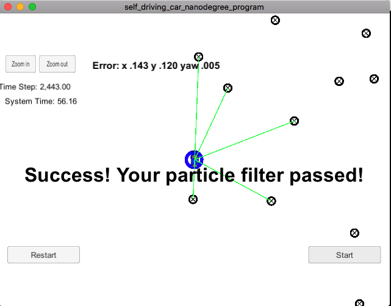

# Kidnapped Vehicle

#### Solution
Please find the file `particle_filter.cpp` src folder

## Running the Code
Run using the following commands:

1. ./clean.sh
2. ./build.sh
3. ./run.sh

see the attached result shows: Success! Your particle filter passed!

